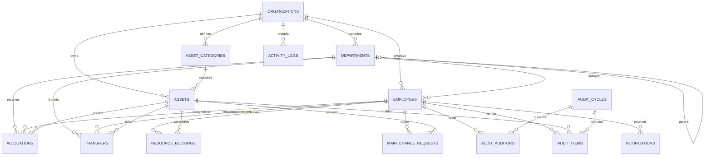

# Database Design Document: AssetFlow

AssetFlow is a role-based Enterprise Asset & Resource Management ERP system. This document outlines the database design, ER diagram, DDL schema, lifecycle state machine, and conflict-prevention mechanisms.

---

## 1. Database Architecture & Choices

### Core Design Decisions

* **Database Engine:** MySQL 8.0+ using the **InnoDB** storage engine (for transaction safety, row-level locking, and foreign key integrity) with `utf8mb4` character set.
* **Primary Keys:** **UUIDs (`CHAR(36)`)** used consistently across all tables rather than auto-incrementing integers.
  * *Trade-off:* UUIDs protect against ID enumeration attacks, simplify multi-tenant data synchronization, and can be generated client-side or in the application layer. While they occupy more index space than `BIGINT`, modern MySQL handles UUID indexes efficiently, and the security/scalability advantages outweigh the slight index size penalty.
* **Soft Delete (`deleted_at`):** Implemented on historical/critical entities (`assets`, `allocations`, `employees`, `audit_cycles`) to preserve system integrity and audit trails. Hard deletes are used on transient metadata/logs where recovery is unnecessary (e.g. session logs, notification records).
* **Lookup Tables vs. ENUMs:** We use lookup tables for roles and statuses where extensibility is expected (e.g., Asset condition, categories). We use `VARCHAR` with CHECK constraints or application-enforced rules for workflows that are deeply tied to hardcoded business logic (e.g. Asset Lifecycle, Booking Status, Maintenance Workflow Status) to prevent schema changes when status names change, and to ensure code and database remain aligned.

---

## 2. ER Diagram



---

## 3. Normalized Schema (3NF Validation)

The database design strictly satisfies Third Normal Form (3NF):
1. **1NF:** All attributes contain atomic values, and there are no repeating groups.
2. **2NF:** All non-key attributes are fully functionally dependent on the entire primary key.
3. **3NF:** All fields are dependent only on the primary key, with no transitive dependencies.
   * *Example:* The `employees` table links to `department_id`, and `departments` links to `organization_id`. We do not duplicate department name or manager details in the `employees` table.
   * *Deliberate Denormalization:* We store `organization_id` directly in child tables (like `assets`, `allocations`, `bookings`) to simplify multi-tenant security filters and optimize queries (scoped to a tenant/organization) without requiring deep joins. This is a standard multi-tenancy optimization.

---

## 4. Complete SQL DDL

```sql
-- Create Database (if not existing)
CREATE DATABASE IF NOT EXISTS assetflow CHARACTER SET utf8mb4 COLLATE utf8mb4_unicode_ci;
USE assetflow;

-- =========================================================================
-- 1. Tenants & Departments
-- =========================================================================

CREATE TABLE organizations (
    id CHAR(36) NOT NULL PRIMARY KEY,
    name VARCHAR(255) NOT NULL,
    slug VARCHAR(255) NOT NULL UNIQUE,
    created_at TIMESTAMP DEFAULT CURRENT_TIMESTAMP,
    updated_at TIMESTAMP DEFAULT CURRENT_TIMESTAMP ON UPDATE CURRENT_TIMESTAMP,
    created_by CHAR(36) NULL,
    updated_by CHAR(36) NULL
) ENGINE=InnoDB;

CREATE TABLE departments (
    id CHAR(36) NOT NULL PRIMARY KEY,
    organization_id CHAR(36) NOT NULL,
    name VARCHAR(255) NOT NULL,
    parent_id CHAR(36) NULL,
    manager_id CHAR(36) NULL,
    status VARCHAR(50) NOT NULL DEFAULT 'Active',
    created_at TIMESTAMP DEFAULT CURRENT_TIMESTAMP,
    updated_at TIMESTAMP DEFAULT CURRENT_TIMESTAMP ON UPDATE CURRENT_TIMESTAMP,
    created_by CHAR(36) NULL,
    updated_by CHAR(36) NULL,
    CONSTRAINT fk_departments_organization FOREIGN KEY (organization_id) REFERENCES organizations(id) ON DELETE CASCADE,
    CONSTRAINT fk_departments_parent FOREIGN KEY (parent_id) REFERENCES departments(id) ON DELETE SET NULL,
    CONSTRAINT chk_department_status CHECK (status IN ('Active', 'Inactive'))
) ENGINE=InnoDB;

-- =========================================================================
-- 2. Employees & Authentication
-- =========================================================================

CREATE TABLE employees (
    id CHAR(36) NOT NULL PRIMARY KEY,
    organization_id CHAR(36) NOT NULL,
    department_id CHAR(36) NULL,
    name VARCHAR(255) NOT NULL,
    email VARCHAR(255) NOT NULL,
    password_hash VARCHAR(255) NOT NULL,
    role VARCHAR(50) NOT NULL DEFAULT 'Employee',
    status VARCHAR(50) NOT NULL DEFAULT 'Active',
    refresh_token VARCHAR(255) NULL,
    created_at TIMESTAMP DEFAULT CURRENT_TIMESTAMP,
    updated_at TIMESTAMP DEFAULT CURRENT_TIMESTAMP ON UPDATE CURRENT_TIMESTAMP,
    created_by CHAR(36) NULL,
    updated_by CHAR(36) NULL,
    deleted_at TIMESTAMP NULL,
    CONSTRAINT uq_employee_email UNIQUE (email),
    CONSTRAINT fk_employees_organization FOREIGN KEY (organization_id) REFERENCES organizations(id) ON DELETE CASCADE,
    CONSTRAINT fk_employees_department FOREIGN KEY (department_id) REFERENCES departments(id) ON DELETE SET NULL,
    CONSTRAINT chk_employee_role CHECK (role IN ('Admin', 'Asset Manager', 'Department Head', 'Employee')),
    CONSTRAINT chk_employee_status CHECK (status IN ('Active', 'Inactive'))
) ENGINE=InnoDB;

-- Set Manager FK on Departments (Circular dependency resolved by adding FK constraints after tables are created)
ALTER TABLE departments ADD CONSTRAINT fk_departments_manager FOREIGN KEY (manager_id) REFERENCES employees(id) ON DELETE SET NULL;

-- =========================================================================
-- 3. Assets & Categories
-- =========================================================================

CREATE TABLE asset_categories (
    id CHAR(36) NOT NULL PRIMARY KEY,
    organization_id CHAR(36) NOT NULL,
    name VARCHAR(255) NOT NULL,
    custom_fields JSON NULL, -- Stores dynamic properties like warranty, power rating, capacity
    created_at TIMESTAMP DEFAULT CURRENT_TIMESTAMP,
    updated_at TIMESTAMP DEFAULT CURRENT_TIMESTAMP ON UPDATE CURRENT_TIMESTAMP,
    created_by CHAR(36) NULL,
    updated_by CHAR(36) NULL,
    CONSTRAINT fk_categories_organization FOREIGN KEY (organization_id) REFERENCES organizations(id) ON DELETE CASCADE
) ENGINE=InnoDB;

CREATE TABLE assets (
    id CHAR(36) NOT NULL PRIMARY KEY,
    organization_id CHAR(36) NOT NULL,
    category_id CHAR(36) NOT NULL,
    asset_tag VARCHAR(100) NOT NULL,
    serial_number VARCHAR(255) NULL,
    name VARCHAR(255) NOT NULL,
    acquisition_date DATE NOT NULL,
    acquisition_cost DECIMAL(15, 2) NOT NULL,
    `condition` VARCHAR(100) NOT NULL DEFAULT 'Good',
    location VARCHAR(255) NOT NULL,
    status VARCHAR(50) NOT NULL DEFAULT 'Available',
    is_shared BOOLEAN NOT NULL DEFAULT FALSE,
    image_url VARCHAR(255) NULL,
    documents_url VARCHAR(255) NULL,
    created_at TIMESTAMP DEFAULT CURRENT_TIMESTAMP,
    updated_at TIMESTAMP DEFAULT CURRENT_TIMESTAMP ON UPDATE CURRENT_TIMESTAMP,
    created_by CHAR(36) NULL,
    updated_by CHAR(36) NULL,
    deleted_at TIMESTAMP NULL,
    CONSTRAINT uq_assets_tag UNIQUE (asset_tag),
    CONSTRAINT fk_assets_organization FOREIGN KEY (organization_id) REFERENCES organizations(id) ON DELETE CASCADE,
    CONSTRAINT fk_assets_category FOREIGN KEY (category_id) REFERENCES asset_categories(id) ON DELETE RESTRICT,
    CONSTRAINT chk_asset_status CHECK (status IN ('Available', 'Allocated', 'Reserved', 'Under Maintenance', 'Lost', 'Retired', 'Disposed')),
    CONSTRAINT chk_asset_condition CHECK (`condition` IN ('New', 'Good', 'Fair', 'Poor', 'Damaged'))
) ENGINE=InnoDB;

-- =========================================================================
-- 4. Allocations & Transfers
-- =========================================================================

CREATE TABLE allocations (
    id CHAR(36) NOT NULL PRIMARY KEY,
    organization_id CHAR(36) NOT NULL,
    asset_id CHAR(36) NOT NULL,
    allocated_to_type VARCHAR(50) NOT NULL, -- 'Employee' or 'Department'
    employee_id CHAR(36) NULL,
    department_id CHAR(36) NULL,
    allocated_by CHAR(36) NOT NULL,
    allocation_date TIMESTAMP DEFAULT CURRENT_TIMESTAMP,
    expected_return_date TIMESTAMP NULL,
    actual_return_date TIMESTAMP NULL,
    return_condition VARCHAR(100) NULL,
    return_notes TEXT NULL,
    status VARCHAR(50) NOT NULL DEFAULT 'Active', -- 'Active', 'Returned', 'Overdue'
    created_at TIMESTAMP DEFAULT CURRENT_TIMESTAMP,
    updated_at TIMESTAMP DEFAULT CURRENT_TIMESTAMP ON UPDATE CURRENT_TIMESTAMP,
    created_by CHAR(36) NULL,
    updated_by CHAR(36) NULL,
    deleted_at TIMESTAMP NULL,
    CONSTRAINT fk_allocations_organization FOREIGN KEY (organization_id) REFERENCES organizations(id) ON DELETE CASCADE,
    CONSTRAINT fk_allocations_asset FOREIGN KEY (asset_id) REFERENCES assets(id) ON DELETE RESTRICT,
    CONSTRAINT fk_allocations_employee FOREIGN KEY (employee_id) REFERENCES employees(id) ON DELETE SET NULL,
    CONSTRAINT fk_allocations_department FOREIGN KEY (department_id) REFERENCES departments(id) ON DELETE SET NULL,
    CONSTRAINT fk_allocations_by FOREIGN KEY (allocated_by) REFERENCES employees(id) ON DELETE RESTRICT,
    CONSTRAINT chk_allocations_type CHECK (allocated_to_type IN ('Employee', 'Department')),
    CONSTRAINT chk_allocations_status CHECK (status IN ('Active', 'Returned', 'Overdue'))
) ENGINE=InnoDB;

CREATE TABLE transfers (
    id CHAR(36) NOT NULL PRIMARY KEY,
    organization_id CHAR(36) NOT NULL,
    asset_id CHAR(36) NOT NULL,
    from_employee_id CHAR(36) NULL,
    from_department_id CHAR(36) NULL,
    to_employee_id CHAR(36) NULL,
    to_department_id CHAR(36) NULL,
    requested_by CHAR(36) NOT NULL,
    approved_by CHAR(36) NULL,
    status VARCHAR(50) NOT NULL DEFAULT 'Pending', -- 'Pending', 'Approved', 'Rejected', 'Cancelled'
    request_notes TEXT NULL,
    approval_notes TEXT NULL,
    created_at TIMESTAMP DEFAULT CURRENT_TIMESTAMP,
    updated_at TIMESTAMP DEFAULT CURRENT_TIMESTAMP ON UPDATE CURRENT_TIMESTAMP,
    created_by CHAR(36) NULL,
    updated_by CHAR(36) NULL,
    CONSTRAINT fk_transfers_organization FOREIGN KEY (organization_id) REFERENCES organizations(id) ON DELETE CASCADE,
    CONSTRAINT fk_transfers_asset FOREIGN KEY (asset_id) REFERENCES assets(id) ON DELETE RESTRICT,
    CONSTRAINT fk_transfers_from_emp FOREIGN KEY (from_employee_id) REFERENCES employees(id) ON DELETE SET NULL,
    CONSTRAINT fk_transfers_from_dept FOREIGN KEY (from_department_id) REFERENCES departments(id) ON DELETE SET NULL,
    CONSTRAINT fk_transfers_to_emp FOREIGN KEY (to_employee_id) REFERENCES employees(id) ON DELETE SET NULL,
    CONSTRAINT fk_transfers_to_dept FOREIGN KEY (to_department_id) REFERENCES departments(id) ON DELETE SET NULL,
    CONSTRAINT fk_transfers_req FOREIGN KEY (requested_by) REFERENCES employees(id) ON DELETE RESTRICT,
    CONSTRAINT fk_transfers_app FOREIGN KEY (approved_by) REFERENCES employees(id) ON DELETE SET NULL,
    CONSTRAINT chk_transfers_status CHECK (status IN ('Pending', 'Approved', 'Rejected', 'Cancelled'))
) ENGINE=InnoDB;

-- =========================================================================
-- 5. Resource Bookings (Shared assets)
-- =========================================================================

CREATE TABLE resource_bookings (
    id CHAR(36) NOT NULL PRIMARY KEY,
    organization_id CHAR(36) NOT NULL,
    asset_id CHAR(36) NOT NULL,
    booked_by CHAR(36) NOT NULL,
    booked_on_behalf_of_dept_id CHAR(36) NULL,
    start_time TIMESTAMP NOT NULL,
    end_time TIMESTAMP NOT NULL,
    status VARCHAR(50) NOT NULL DEFAULT 'Upcoming', -- 'Upcoming', 'Ongoing', 'Completed', 'Cancelled'
    notes TEXT NULL,
    created_at TIMESTAMP DEFAULT CURRENT_TIMESTAMP,
    updated_at TIMESTAMP DEFAULT CURRENT_TIMESTAMP ON UPDATE CURRENT_TIMESTAMP,
    created_by CHAR(36) NULL,
    updated_by CHAR(36) NULL,
    CONSTRAINT fk_bookings_organization FOREIGN KEY (organization_id) REFERENCES organizations(id) ON DELETE CASCADE,
    CONSTRAINT fk_bookings_asset FOREIGN KEY (asset_id) REFERENCES assets(id) ON DELETE RESTRICT,
    CONSTRAINT fk_bookings_by FOREIGN KEY (booked_by) REFERENCES employees(id) ON DELETE RESTRICT,
    CONSTRAINT fk_bookings_dept FOREIGN KEY (booked_on_behalf_of_dept_id) REFERENCES departments(id) ON DELETE SET NULL,
    CONSTRAINT chk_bookings_time CHECK (end_time > start_time),
    CONSTRAINT chk_bookings_status CHECK (status IN ('Upcoming', 'Ongoing', 'Completed', 'Cancelled'))
) ENGINE=InnoDB;

-- =========================================================================
-- 6. Maintenance Management
-- =========================================================================

CREATE TABLE maintenance_requests (
    id CHAR(36) NOT NULL PRIMARY KEY,
    organization_id CHAR(36) NOT NULL,
    asset_id CHAR(36) NOT NULL,
    raised_by CHAR(36) NOT NULL,
    approved_by CHAR(36) NULL,
    issue_description TEXT NOT NULL,
    priority VARCHAR(50) NOT NULL DEFAULT 'Medium', -- 'Low', 'Medium', 'High', 'Critical'
    photo_url VARCHAR(255) NULL,
    status VARCHAR(50) NOT NULL DEFAULT 'Pending', -- 'Pending', 'Approved', 'Rejected', 'Technician Assigned', 'In Progress', 'Resolved'
    assigned_technician VARCHAR(255) NULL,
    approved_at TIMESTAMP NULL,
    resolved_at TIMESTAMP NULL,
    resolution_notes TEXT NULL,
    created_at TIMESTAMP DEFAULT CURRENT_TIMESTAMP,
    updated_at TIMESTAMP DEFAULT CURRENT_TIMESTAMP ON UPDATE CURRENT_TIMESTAMP,
    created_by CHAR(36) NULL,
    updated_by CHAR(36) NULL,
    CONSTRAINT fk_maintenance_organization FOREIGN KEY (organization_id) REFERENCES organizations(id) ON DELETE CASCADE,
    CONSTRAINT fk_maintenance_asset FOREIGN KEY (asset_id) REFERENCES assets(id) ON DELETE RESTRICT,
    CONSTRAINT fk_maintenance_raised FOREIGN KEY (raised_by) REFERENCES employees(id) ON DELETE RESTRICT,
    CONSTRAINT fk_maintenance_approved FOREIGN KEY (approved_by) REFERENCES employees(id) ON DELETE SET NULL,
    CONSTRAINT chk_maintenance_priority CHECK (priority IN ('Low', 'Medium', 'High', 'Critical')),
    CONSTRAINT chk_maintenance_status CHECK (status IN ('Pending', 'Approved', 'Rejected', 'Technician Assigned', 'In Progress', 'Resolved'))
) ENGINE=InnoDB;

-- =========================================================================
-- 7. Audit Cycles
-- =========================================================================

CREATE TABLE audit_cycles (
    id CHAR(36) NOT NULL PRIMARY KEY,
    organization_id CHAR(36) NOT NULL,
    name VARCHAR(255) NOT NULL,
    scope_type VARCHAR(50) NOT NULL, -- 'Department', 'Location', 'All'
    scope_department_id CHAR(36) NULL,
    scope_location VARCHAR(255) NULL,
    start_date DATE NOT NULL,
    end_date DATE NOT NULL,
    status VARCHAR(50) NOT NULL DEFAULT 'Draft', -- 'Draft', 'Active', 'Completed', 'Closed'
    created_at TIMESTAMP DEFAULT CURRENT_TIMESTAMP,
    updated_at TIMESTAMP DEFAULT CURRENT_TIMESTAMP ON UPDATE CURRENT_TIMESTAMP,
    created_by CHAR(36) NULL,
    updated_by CHAR(36) NULL,
    deleted_at TIMESTAMP NULL,
    CONSTRAINT fk_audits_organization FOREIGN KEY (organization_id) REFERENCES organizations(id) ON DELETE CASCADE,
    CONSTRAINT fk_audits_dept FOREIGN KEY (scope_department_id) REFERENCES departments(id) ON DELETE SET NULL,
    CONSTRAINT chk_audits_type CHECK (scope_type IN ('Department', 'Location', 'All')),
    CONSTRAINT chk_audits_status CHECK (status IN ('Draft', 'Active', 'Completed', 'Closed')),
    CONSTRAINT chk_audits_dates CHECK (end_date >= start_date)
) ENGINE=InnoDB;

CREATE TABLE audit_auditors (
    audit_cycle_id CHAR(36) NOT NULL,
    employee_id CHAR(36) NOT NULL,
    PRIMARY KEY (audit_cycle_id, employee_id),
    CONSTRAINT fk_auditors_cycle FOREIGN KEY (audit_cycle_id) REFERENCES audit_cycles(id) ON DELETE CASCADE,
    CONSTRAINT fk_auditors_employee FOREIGN KEY (employee_id) REFERENCES employees(id) ON DELETE CASCADE
) ENGINE=InnoDB;

CREATE TABLE audit_items (
    id CHAR(36) NOT NULL PRIMARY KEY,
    audit_cycle_id CHAR(36) NOT NULL,
    asset_id CHAR(36) NOT NULL,
    auditor_id CHAR(36) NULL,
    verification_status VARCHAR(50) NOT NULL DEFAULT 'Pending', -- 'Pending', 'Verified', 'Missing', 'Damaged'
    notes TEXT NULL,
    verified_at TIMESTAMP NULL,
    created_at TIMESTAMP DEFAULT CURRENT_TIMESTAMP,
    updated_at TIMESTAMP DEFAULT CURRENT_TIMESTAMP ON UPDATE CURRENT_TIMESTAMP,
    created_by CHAR(36) NULL,
    updated_by CHAR(36) NULL,
    CONSTRAINT fk_items_cycle FOREIGN KEY (audit_cycle_id) REFERENCES audit_cycles(id) ON DELETE CASCADE,
    CONSTRAINT fk_items_asset FOREIGN KEY (asset_id) REFERENCES assets(id) ON DELETE RESTRICT,
    CONSTRAINT fk_items_auditor FOREIGN KEY (auditor_id) REFERENCES employees(id) ON DELETE SET NULL,
    CONSTRAINT chk_items_status CHECK (verification_status IN ('Pending', 'Verified', 'Missing', 'Damaged'))
) ENGINE=InnoDB;

-- =========================================================================
-- 8. Notifications & System logs
-- =========================================================================

CREATE TABLE notifications (
    id CHAR(36) NOT NULL PRIMARY KEY,
    organization_id CHAR(36) NOT NULL,
    recipient_id CHAR(36) NOT NULL,
    title VARCHAR(255) NOT NULL,
    message TEXT NOT NULL,
    type VARCHAR(50) NOT NULL, -- 'Asset Assigned', 'Maintenance Approved', etc.
    related_entity_type VARCHAR(50) NULL,
    related_entity_id CHAR(36) NULL,
    is_read BOOLEAN NOT NULL DEFAULT FALSE,
    created_at TIMESTAMP DEFAULT CURRENT_TIMESTAMP,
    CONSTRAINT fk_notifications_organization FOREIGN KEY (organization_id) REFERENCES organizations(id) ON DELETE CASCADE,
    CONSTRAINT fk_notifications_recipient FOREIGN KEY (recipient_id) REFERENCES employees(id) ON DELETE CASCADE
) ENGINE=InnoDB;

CREATE TABLE activity_logs (
    id CHAR(36) NOT NULL PRIMARY KEY,
    organization_id CHAR(36) NOT NULL,
    user_id CHAR(36) NULL,
    action VARCHAR(255) NOT NULL,
    entity_type VARCHAR(50) NOT NULL,
    entity_id CHAR(36) NULL,
    details JSON NULL,
    created_at TIMESTAMP DEFAULT CURRENT_TIMESTAMP,
    CONSTRAINT fk_logs_organization FOREIGN KEY (organization_id) REFERENCES organizations(id) ON DELETE CASCADE,
    CONSTRAINT fk_logs_user FOREIGN KEY (user_id) REFERENCES employees(id) ON DELETE SET NULL
) ENGINE=InnoDB;

-- =========================================================================
-- Indexing Strategy (Optimized for high-frequency queries)
-- =========================================================================

-- Asset searches and filters
CREATE INDEX idx_assets_filters ON assets (organization_id, category_id, status, location);
CREATE INDEX idx_assets_search ON assets (asset_tag, serial_number);

-- Overlap booking lookup
CREATE INDEX idx_bookings_time ON resource_bookings (asset_id, status, start_time, end_time);

-- Audit cycles
CREATE INDEX idx_audit_items_status ON audit_items (audit_cycle_id, verification_status);

-- Overdue allocations lookup
CREATE INDEX idx_allocations_overdue ON allocations (organization_id, status, expected_return_date, actual_return_date);

-- Notifications
CREATE INDEX idx_notifications_unread ON notifications (recipient_id, is_read);
```

---

## 5. Asset Lifecycle State Machine

The transitions between states of an `Asset` must follow strict business-rules enforced in both the service layer and database constraints.

| Source State | Destination State | Trigger Event | Allowed Roles |
| :--- | :--- | :--- | :--- |
| **Available** | **Allocated** | Asset assigned to employee/department | Asset Manager, Admin |
| **Available** | **Reserved** | Shared resource booking start | Employee, Dept Head |
| **Available** | **Under Maintenance**| Maintenance request approved | Asset Manager, Admin |
| **Available** | **Lost** | Audit marks missing / report lost | Auditor, Asset Manager |
| **Available** | **Retired** / **Disposed** | Decommission / Disposal | Asset Manager, Admin |
| **Allocated** | **Available** | Asset return completed & checked in | Asset Manager |
| **Allocated** | **Under Maintenance**| Active asset reported broken (auto-unallocates) | Asset Manager |
| **Allocated** | **Lost** | Audit marks missing / report lost | Auditor, Asset Manager |
| **Reserved** | **Available** | Resource booking ended/cancelled | System, Employee |
| **Under Maintenance** | **Available** | Maintenance resolved / repair complete | Asset Manager |
| **Lost** | **Available** | Found asset during audit / manual | Auditor, Asset Manager |
| **Lost** | **Disposed** | Confirmed loss write-off | Asset Manager, Admin |

### Database Enforcement
A trigger can be defined in MySQL to prevent incorrect updates to the `status` column, or this can be managed reliably in a centralized Service-layer state machine wrapped in SQL transactions. We will implement both:
1. central application service model transitions.
2. database validations via transaction validation queries.

---

## 6. Conflict-Prevention Design

### Prevention of Double Allocation
To prevent an asset from being simultaneously allocated to multiple entities, we follow a strict transactional sequence:
1. Obtain an exclusive lock on the asset record:
   ```sql
   SELECT id, status FROM assets WHERE id = ? FOR UPDATE;
   ```
2. Validate that the asset's current status is exactly `Available`.
3. If not `Available`, abort the transaction and throw an allocation conflict error (returning details of the current allocation).
4. If `Available`, insert the `allocations` record and update `assets.status` to `Allocated` inside the same transaction.

### Prevention of Overlapping Resource Bookings
For shared resource bookings, two bookings for the same asset cannot overlap.
1. When booking a slot (`:start_time` to `:end_time`), lock the asset:
   ```sql
   SELECT id FROM assets WHERE id = :asset_id FOR UPDATE;
   ```
2. Verify if the asset is shared (`is_shared = TRUE`) and status is `Available` or `Reserved`.
3. Execute the overlap checking query:
   ```sql
   SELECT COUNT(*) FROM resource_bookings 
   WHERE asset_id = :asset_id 
     AND status IN ('Upcoming', 'Ongoing')
     AND start_time < :end_time 
     AND end_time > :start_time;
   ```
4. If the count is greater than 0, reject the booking immediately.
5. If count is 0, commit the booking record and set asset status to `Reserved`.
