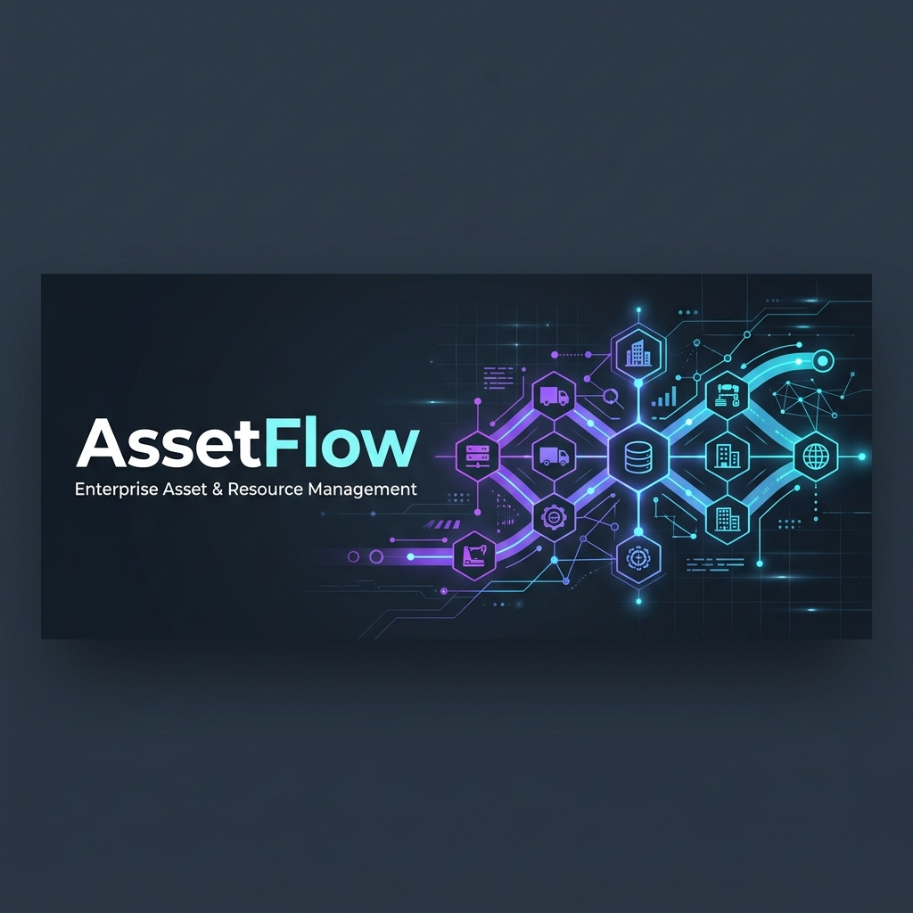

# AssetFlow Client Portal — Frontend UI & User Experience

<p align="center">
  
</p>

<p align="center">
  
  
  
  
  
</p>

---

## 📖 Table of Contents
1. [Overview](#-overview)
2. [⚡ Tech Stack & UI Orchestration](#-tech-stack--ui-orchestration)
3. [📂 Core Views & Pages](#-core-views--pages)
4. [🏗️ State & Client Architecture](#️-state--client-architecture)
5. [🚀 Getting Started](#-getting-started)
6. [🛠️ Setup Command Cheat-Sheet](#️-setup-command-cheat-sheet)
7. [🚨 Troubleshooting & FAQ](#-troubleshooting--faq)
8. [🧪 Styling Guidelines & Customization](#-styling-guidelines--customization)

---

## 📖 Overview

The **AssetFlow Client Portal** is a high-performance, single-page application (SPA) built using React 19, TypeScript, and Vite. It serves as the primary administration and employee self-service interface for the AssetFlow ERP system. 

It is designed with a premium, dark-themed dashboard style featuring smooth micro-animations, real-time alert updates, and a fully responsive grid-layout.

> [!NOTE]
> All interface actions communicate asynchronously with the backend gateway. State synchronization is managed using cache-aside structures inside TanStack Query, keeping network payload sizes lightweight.

---

## ⚡ Tech Stack & UI Orchestration

* **React 19 & Vite:** Next-generation rendering framework coupled with the fastest development server and bundler.
* **Zustand:** Ultra-lightweight, high-performance state management for handling user session states, real-time notifications, and global UI contexts.
* **TanStack Query (React Query) v5:** Handles caching, automatic re-fetching, and synchronization of database-driven network requests.
* **Tailwind CSS:** Responsive utilities with custom animation configurations (`tailwindcss-animate`).
* **Framer Motion & GSAP:** Dynamic page-load transitions, modal pop-ups, and custom staggered list timelines.
* **Lenis:** Smooth, inertia-based scrolling for premium scrolling feel across complex data grids.
* **Iconography:** Lucide React for consistent vector icons.
* **html2canvas & jsPDF:** Client-side generation and rendering of downloadable PDF reports.
* **Oxlint:** Ultra-fast rust-based linter enforcing clean code guidelines.

---

## 📂 Core Views & Pages

The client portal includes 10 purpose-built dashboard routes inside `src/pages/`:

| Page File | Purpose & UI Features |
| :--- | :--- |
| **`Dashboard.tsx`** | The central hub displaying metrics cards (total assets, active maintenance, current bookings) and interactive heatmaps. |
| **`OrganizationSetup.tsx`** | Admin-only portal to design tenant hierarchies, build parent-child departments, and assign department heads. |
| **`AssetRegistry.tsx`** | Multi-column grid containing all physical assets, barcode generation views, and custom schema field editors. |
| **`AssetAllocation.tsx`** | Checkout/return tracking forms, department-to-department transfers, and timeline views of previous assignments. |
| **`ResourceBooking.tsx`** | Interactive reservation calendar for shared rooms and assets, complete with error handling for slot conflicts. |
| **`Maintenance.tsx`** | Issue ticket submission portal, technician routing drop-downs, and maintenance task checklists. |
| **`AssetAudit.tsx`** | Active audit cycle list showing auditor assignments, mismatch input forms, and data freeze indicators. |
| **`Reports.tsx`** | Aggregated reports with CSV/PDF download buttons, date range pickers, and category filters. |
| **`ActivityLogs.tsx`** | Read-only security audit trail showing recent logins, asset transfers, and system alerts. |
| **`Login.tsx`** | Sleek, glassmorphic login screen containing email, password inputs, and token authorization. |

---

## 🏗️ State & Client Architecture

### 1. Store Management (`src/store/`)
Global states are modularly divided into Zustand store modules:
* `authStore.ts`: Tracks logged-in users, JWT expiry timers, and user-role access privileges.
* `notificationStore.ts`: Receives real-time push alerts from backend WebSockets and appends them to the active client notifications tray.

### 2. Client-Side Authentication Guard
* Routes are wrapper-protected using a custom component.
* Unauthenticated requests automatically redirect to `/login`.
* Role-based routes check user-roles against authorization definitions, showing custom "Access Denied" panels if unauthorized.

---

## 🚀 Getting Started

1. **Install NPM Modules:**
   ```bash
   npm install --legacy-peer-deps
   ```

2. **Run in Development Mode:**
   ```bash
   npm run dev
   ```
   The portal will open locally on `http://localhost:5173/`.

3. **Validate Code Lints:**
   Use the high-speed Oxlint linter to detect code errors:
   ```bash
   npm run lint
   ```

4. **Production Build Compilation:**
   ```bash
   npm run build
   ```
   Compiles optimized static assets inside the `dist/` directory.

---

## 🛠️ Setup Command Cheat-Sheet

| Action | Command | Description |
| :--- | :--- | :--- |
| **Install Packages** | `npm install --legacy-peer-deps` | Installs modules bypassing peer-dependency boundaries. |
| **Run Dev Server** | `npm run dev` | Runs Vite dev server with Hot Module Replacement (HMR). |
| **Run Linter** | `npm run lint` | Runs `oxlint` static code analysis. |
| **Compile Build** | `npm run build` | Builds a production-optimized folder inside `dist/`. |
| **Preview Build** | `npm run preview` | Spins up a local web server displaying the production bundle. |

---

## 🚨 Troubleshooting & FAQ

#### Q: The build warning: `Some chunks are larger than 500 kB after minification` shows up.
> [!NOTE]
> This is a standard warning from Vite/Rollup when large modules (like GSAP or jsPDF) are compiled. It does not affect functionality. If desired, you can configure code-splitting (dynamic imports) under `vite.config.ts`.

#### Q: I see connection errors on WebSocket / Real-time updates.
> [!TIP]
> Ensure the backend development server is running on `http://localhost:5000`. The client websocket adapter expects the gateway to be online to complete the initial handshake protocol.

#### Q: How do I change the default API base URL?
> [!TIP]
> API requests use an Axios client helper. You can configure endpoint paths or base gateways inside [src/lib/](file:///Users/shaswat/Documents/odoo/Odoo_Hackathon_2026/frontend/src/lib/).

---

## 🧪 Styling Guidelines & Customization

Custom utility classes and animation transitions are defined in [index.css](file:///Users/shaswat/Documents/odoo/Odoo_Hackathon_2026/frontend/src/index.css) and [App.css](file:///Users/shaswat/Documents/odoo/Odoo_Hackathon_2026/frontend/src/App.css). 

To customize branding colors, fonts, or animations, modify the tailwind configuration file at [tailwind.config.js](file:///Users/shaswat/Documents/odoo/Odoo_Hackathon_2026/frontend/tailwind.config.js).

---
<p align="center">Made with ❤️ for the Odoo Hackathon 2026</p>
